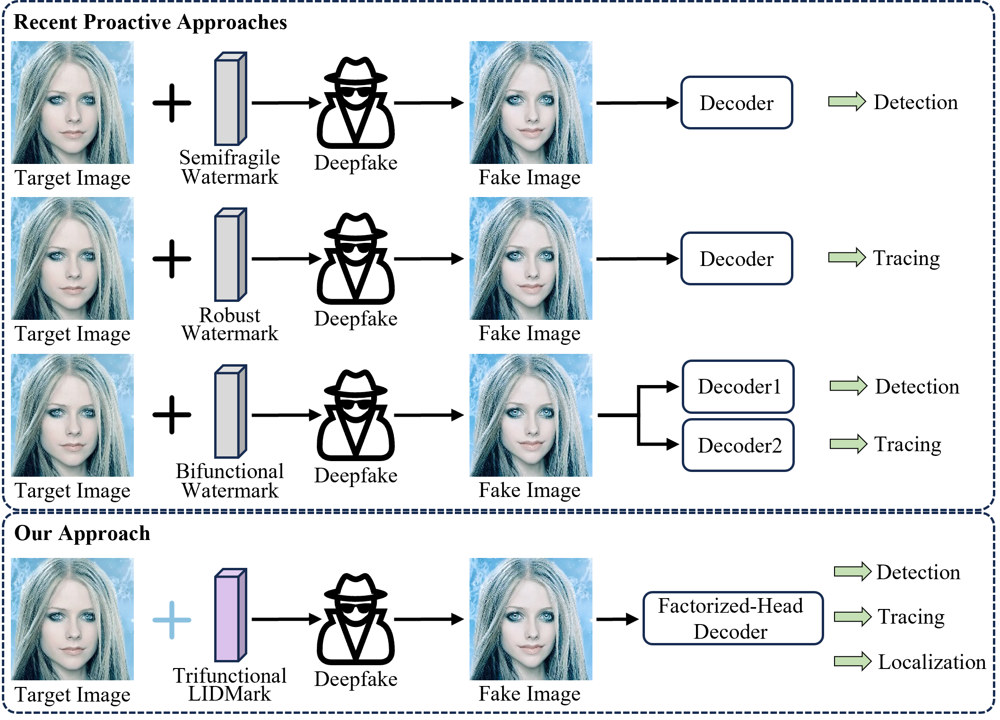
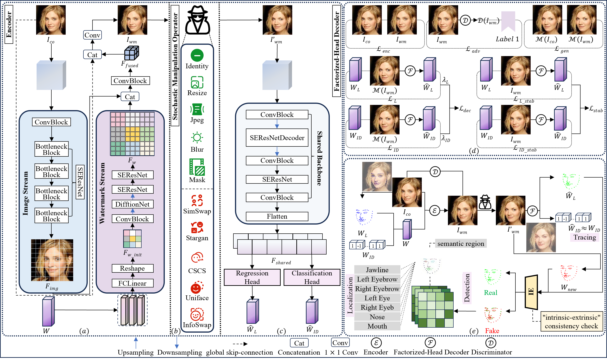

<div align="center">
<h1> All in One: Unifying Deepfake Detection, Tampering Localization, and Source Tracing with a Robust Landmark-Identity Watermark </h1>

<div>
    <a href='https://junjiang-wu.github.io/' target='_blank'>Junjiang Wu</a><sup>1</sup>&emsp;
    <a href='https://it.xju.edu.cn/info/1155/3270.htm' target='_blank'>Liejun Wang</a><sup>1, 2</sup>&emsp;
    <a href='http://www.guozhiqing.cn/' target='_blank'>Zhiqing Guo</a><sup>1, 2</sup>
</div>
<div>
    <sup>1</sup>School of Computer Science and Technology, Xinjiang University, Urumqi, China&emsp;
    <sup>2</sup>Xinjiang Multimodal Intelligent Processing and Information Security Engineering Technology Research Center, Urumqi, China
</div>
<br>
<a href="https://arxiv.org/abs/2602.23523">-red.svg" alt="Paper"></a>
<a href="https://junjiang-wu.github.io/projects/lidmark/">-blue.svg" alt="Project"></a>
<!-- <a href="CR_LINK">-green.svg" alt="Camera Ready"></a> -->
</div>
 
## 🔥 News
* **[2026-02]** Our paper was accepted to IEEE/CVF Conf erence on Computer Vision and Pattern Recognition 2026 **(CVPR 2026)** !  🎉


## 📆 Release Plan
- [x] Launch the project page.
- [x] Release the arXiv paper.
- [x] Publish dataset preparation instructions.
- [x] Release the training and inference code.
- [ ] Release the pre-trained weights.


## ✨ Highlights
* **Novel Landmark-Identity Watermark (LIDMark):** We propose a 152-D high-capacity watermark, the first to structurally interweave a 136-D tamper-sensitive facial landmark vector with a 16-D robust source identifier into a single, unified payload.
* **Task-Aware Factorized-Head Decoder (FHD):** We design a novel decoding architecture that factorizes shared backbone features into specialized regression and classification heads. This enables the concurrent and robust reconstruction of LIDMark's heterogeneous components.
* **Trifunctional Forensics Framework:** We present the first "all-in-one" solution for joint deepfake detection, tampering localization, and source tracing, powered by LIDMark, FHD, and a novel "intrinsic-extrinsic" consistency check.


## 📖 Introduction
This is the official repository for the CVPR 2026 paper *"[All in One: Unifying Deepfake Detection, Tampering Localization, and Source Tracing with a Robust Landmark-Identity Watermark](https://arxiv.org/abs/2602.23523)"*.

<div align="center"> 
   
</div>

> **Fig. 1: Comparison of proactive deepfake forensic paradigms.** Conventional approaches shown at the top are limited to single tasks or require complex dual-decoder architectures for bifunctional forensics. The proposed "all-in-one" framework illustrated at the bottom employs the trifunctional LIDMark and a novel FHD for joint deepfake detection, source tracing, and tampering localization.


## 🧩 Overview
<div align="center"> 
   
</div>

> **Fig. 2: Overview of the LIDMark framework.** To imperceptibly embed and robustly recover LIDMark, we propose the end-to-end LIDMark framework, which comprises an encoder, a novel factorized-head decoder, and a discriminator, jointly trained against a stochastic manipulation operator.


## 🗂️ Dataset Preparation

LIDMark is trained on CelebA-HQ and evaluated on both CelebA-HQ and LFW. We do not own the copyright to these datasets. Please download them directly from their official webpages. Please follow the steps below to prepare your data environment.
### 1. Image Data
Download the official datasets and pre-process (crop and resize) the images into **128×128** and **256×256** resolutions.

* [Download CelebA-HQ](https://mmlab.ie.cuhk.edu.hk/projects/CelebA.html)
* [Download LFW](https://vis-www.cs.umass.edu/lfw/)

### 2. LIDMark Data
To facilitate reproduction, we provide the pre-generated paired LIDMark data (`.npy` files) used in our experiments. Download and extract the package into the `./dataset/` directory.

* 🇨🇳 **Baidu Netdisk:** [Download LIDMark Data](https://pan.baidu.com/s/18l3Vj-H0YMMP6CivDPPSKg?pwd=VPSG) (Password: `VPSG`)
* 🌍 **Google Drive:** [Download LIDMark Data](https://drive.google.com/file/d/1V3JrZ7vHoEkDYWxpiODF62ovd5PXPfvC/view?usp=sharing)

### 3. Final Directory Layout
Ensure your project structure matches the hierarchy below before starting the training or evaluation process:
```text
LIDMark/dataset/
├── image/
│   ├── celeba-hq_{128, 256}/    # image data (*.jpg) at 128x128 & 256x256
│   │   ├── train/
│   │   ├── val/
│   │   └── test/
└── watermark_152/
    └── celeba-hq/
        ├── {128, 256}/          # paired LIDMark data (*.npy)
        │   ├── train/
        │   ├── val/
        │   └── test/
```


## 💻 Environment Setup

We recommend using **Anaconda** or **Miniconda** to manage the Python environment.

```bash
# 1. Create and activate a new environment with Python 3.8
conda create -n LIDMark python=3.8 -y
conda activate LIDMark

# 2. Install PyTorch (Conda is recommended for CUDA compatibility)
conda install pytorch==2.1.2 torchvision==0.16.2 torchaudio==2.1.2 pytorch-cuda=11.8 -c pytorch -c nvidia

# 3. Install the remaining dependencies
pip install -r requirements.txt
```


## 🎭 Deepfake Manipulation Operator

Within our stochastic manipulation operator, we employ SimSwap, UniFace, CSCS, and StarGAN-v2 as the deepfake manipulations during training. For testing, we further incorporate InfoSwap as an unseen manipulation method.

> **Note:** Due to licensing restrictions, we do not redistribute the source code or pre-trained weights of these third-party methods. Please visit their official repositories to download the necessary checkpoints and for implementation details.

* [SimSwap](https://github.com/neuralchen/SimSwap)
* [UniFace](https://github.com/xc-csc101/UniFace)
* [CSCS](https://github.com/ICTMCG/CSCS)
* [StarGAN-v2](https://github.com/clovaai/stargan-v2)
* [InfoSwap](https://github.com/GGGHSL/InfoSwap-master)

**Setup:** After downloading the pre-trained checkpoints from the respective official repositories, please extract and organize them into the `./model/` directory as follows:
```
LIDMark/
├── model/
│   ├── SimSwap/
│   ├── UniFace/
│   ├── CSCS/
│   ├── StarGAN/
│   └── InfoSwap/
```


---
## 🚀 Training

**Stage 1:** Pre-training on common distortions. In this stage, the framework is trained from scratch. The primary objective is to establish high imperceptibility and robustness against standard image processing operations as defined in `train_distortions.yaml`.

```bash
# Train on 128x128 resolution
python main.py train_distortions --res 128

# Train on 256x256 resolution
python main.py train_distortions --res 256
```
**Stage 2:** Fine-tuning on Deepfake Manipulations. Building upon the pre-trained weights from Stage 1, this stage further optimizes the model to survive aggressive facial manipulations. The framework is fine-tuned against a diverse set of deepfake generators to ensure the LIDMark remains retrievable after identity swapping or reenactment.
**Note:** Ensure the pre-trained checkpoints from Stage 1 are available in the `./weights/<res>_152/checkpoints_distortions/` directory before initiating this stage.
```
# Fine-tune on 128x128 resolution
python main.py tune_deepfakes --res 128

# Fine-tune on 256x256 resolution
python main.py tune_deepfakes --res 256
```


## 📊 Testing

The unified test script comprehensively evaluates the framework's performance across three key dimensions: watermark invisibility, and robustness against common distortions and deepfake manipulations.
```
# Evaluate on 128x128 resolution
python main.py test --res 128

# Evaluate on 256x256 resolution
python main.py test --res 256
```

---
## 🎨 Visualization Results

<div align="center">  </div>

> **Fig. 3: Visual assessment of LIDMark robustness and imperceptibility.**
---


## ✒️ Citation

If you find this repository helpful, please cite our paper:
```bibtex
@inproceedings{wu2026all,
  title={All in One: Unifying Deepfake Detection, Tampering Localization, and Source Tracing with a Robust Landmark-Identity Watermark},
  author={Wu, Junjiang and Wang, Liejun and Guo, Zhiqing},
  booktitle={Proceedings of the IEEE/CVF Conference on Computer Vision and Pattern Recognition},
  year={2026}
}
@misc{wu2026oneunifyingdeepfakedetection,
      title={All in One: Unifying Deepfake Detection, Tampering Localization, and Source Tracing with a Robust Landmark-Identity Watermark}, 
      author={Junjiang Wu and Liejun Wang and Zhiqing Guo},
      year={2026},
      eprint={2602.23523},
      archivePrefix={arXiv},
      primaryClass={cs.CV},
      url={https://arxiv.org/abs/2602.23523}, 
}
```


## 👏 Acknowledgements

This project is built upon several excellent open-source repositories and datasets. We would like to express our sincere gratitude to the authors of the following projects for their contributions to the community:
* **Deepfake Generators:** [SimSwap](https://github.com/neuralchen/SimSwap), [UniFace](https://github.com/xc-csc101/UniFace), [CSCS](https://github.com/ICTMCG/CSCS), [StarGAN-v2](https://github.com/clovaai/stargan-v2), and [InfoSwap](https://github.com/GGGHSL/InfoSwap-master).
* **Baseline Methods:** [LampMark](https://github.com/wangty1/LampMark), [DiffMark](https://github.com/vpsg-research/DiffMark), [EditGuard](https://github.com/xuanyuzhang21/EditGuard), and [KAD-Net](https://github.com/vpsg-research/KAD-Net), among others.
* **Face Alignment:** [face-alignment](https://github.com/1adrianb/face-alignment).
* **Datasets:** [CelebA-HQ](https://mmlab.ie.cuhk.edu.hk/projects/CelebA.html) and [LFW](https://vis-www.cs.umass.edu/lfw/).


## 📜 License

This project is licensed under the [Apache 2.0 License](https://github.com/vpsg-research/LIDMark/blob/main/LICENSE).

---